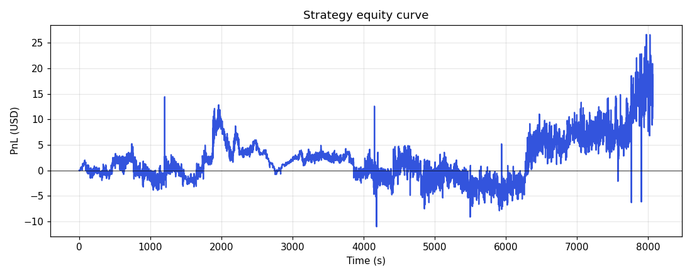

# Cross-exchange delta-neutral perp market maker

A Python prototype of a cross-exchange market-making strategy for the BTC-USDT perpetual on **Binance** and **Bybit**. Quotes maker orders on the quote venue, hedges fills on the other venue, and uses cross-venue signals (basis, OFI, mean-reversion) to skew/pause whichever side is about to be adverse-selected.

Comes with:

- Tick-by-tick **historical replay** harness (Binance + Bybit public archives)
- **Live paper-trading** harness against real Binance + Bybit WS feeds (no API keys needed — public data only, no orders are sent)
- A signal-driven **smart quoter** that asymmetrically sizes & pauses sides based on cross-venue spread
- A maker-first **hedger** with adaptive timeouts and internal hedging
- A drawdown circuit breaker
- A queue-position-aware **fill simulator**
- A structured **JSONL logger** for every fill, signal, and event — so you can debug runs offline
- A **performance metrics** analyzer: Sharpe, Sortino, Calmar, MaxDD, CAGR, Alpha/Beta, IR, VaR/CVaR, Slippage, Fill Ratio, Turnover, Exposure, and more


*Smart-quoter equity curve over ~134 minutes of 2024-05-01 BTC-USDT perp data*

---

## What the strategy is actually doing

For each tick from Binance or Bybit it maintains a local L2 book per venue, a consolidated mid, an inventory `q` per venue, and three signals: **microprice**, **order-flow imbalance (OFI)** over a rolling window, and the **cross-venue basis** (Binance mid − Bybit mid). On every tick:

1. **Quoter** posts a bid and an ask on Binance, anchored to the **touch** (best-bid / best-ask) and stepped back N ticks. Each side gets:
   - a **step-back** that grows with adverse-direction signal strength (OFI, basis, vol, MR)
   - a **size multiplier** that grows when the basis is in *its* favour and shrinks toward zero when unfavourable
   - a **hard skip** if the side's favourability score falls below a configurable threshold
2. **Hedger** kicks in when net delta exceeds `no_hedge_below_fraction × max_inventory`. It posts a maker hedge on Bybit at the BBO. If the maker doesn't fill within the timeout (60s patient, 1.5s urgent), it converts to a taker. Below the threshold, the *opposite-side Binance quote* is expected to flatten the position naturally — no Bybit fees paid.
3. **Drawdown circuit breaker** pauses both sides for 90s if running PnL drops more than `$8` in any 2-minute window.
4. **Vol pause** halts both sides when realised vol exceeds the configured threshold.
5. **Structured logger** writes a fill record (with full signal context), a periodic snapshot, and any pause/halt event.

After the run, a separate analyzer computes the full suite of performance metrics and saves them to disk alongside the raw logs.

The full architectural detail (signal formulas, fill model, fee accounting, hedge policy) is documented inline in each module.

---

## Quick start

```bash
git clone https://github.com/<you>/crypto-mm.git
cd crypto-mm
pip install -r requirements.txt
```

### 1. Synthetic smoke test (no network)

```bash
python run_backtest.py --synthetic --minutes 5 \
       --config smoke_test_config.yaml --sigma 50
```

### 2. Historical backtest on real data

```bash
# one-time: fetch Binance + Bybit archives for a date (~150 MB on disk)
python data/fetch_historical.py --date 2024-05-01

# replay tick-by-tick
python run_backtest.py --date 2024-05-01 --config smart_config.yaml
```

At the end you'll see a path printed:

```
[performance] wrote performance.txt and performance.json to logs/<run_id>
```

Inspect:

```bash
cat logs/<run_id>/performance.txt
```

### 3. Live paper trading (public WS, no orders sent)

```bash
python run_paper.py --config smart_config.yaml --seconds 600
```

Streams Binance USDM-perp and Bybit linear book + trade tickers, runs the engine in real time, prints per-5-second telemetry, simulates fills, and writes the same `logs/<run_id>/` directory at the end.

---

## What gets written by a backtest

Every run creates `logs/<run_id>/` with:

| File | Contents |
|---|---|
| `meta.json` | The exact config used for the run (reproducibility) |
| `fills.jsonl` | One row per fill: price, size, side, all signal values at fill time, pre/post position, PnL after fill |
| `events.jsonl` | Strategy events: pauses, drawdown halts, side suppressions |
| `snapshots.jsonl` | Periodic PnL + inventory + signals + mids (default every 10 s) |
| `performance.txt` | Human-readable performance metrics report |
| `performance.json` | Same metrics as a JSON blob for further analysis |

Loading any of these for analysis is trivial:

```python
import pandas as pd
fills = pd.read_json("logs/<run_id>/fills.jsonl", lines=True)
fills.groupby("side")["price"].describe()
```

The included `backtest/analyze_logs.py` does fill-quality + adverse-selection bucketing out of the box.

---

## Configurations

Four ready-to-use configs ship in the repo:

| File | Purpose |
|---|---|
| `config.yaml` | Realistic deep maker (4 bps from mid). Conservative; few fills per day. |
| `smart_config.yaml` | The full signal-driven setup. Asymmetric sizing, maker-first hedger, drawdown halt. **Recommended default.** |
| `live_demo_config.yaml` | Touch-anchored quoter that joins the BBO. Designed to fill within minutes on live data — useful for verifying the pipeline. Not profitable per se. |
| `smoke_test_config.yaml` | Aggressive synthetic-data test config. Don't use on live data. |

Every knob is in YAML. The most impactful tunables in `smart_config.yaml`:

```yaml
ticks_from_touch: -5             # depth of resting quote behind BBO (in ticks)
size_boost_per_favourable_bp: 0.8  # how aggressively to scale up on favourable basis
unfavourable_skip_bps: 1.2       # skip a side completely when its favourability drops below
basis_hard_pause_bps: 2.5        # hard skip threshold for cross-venue basis
hedge_timeout_low_inv_ms: 180000 # how long the hedger waits on maker before going taker
no_hedge_below_fraction: 0.75    # how much inventory accumulates before external hedge
dd_halt_usd: 8                   # drawdown halt threshold
```

---

## Performance metrics computed

The auto-generated `performance.txt` covers, with formulas in `backtest/performance.py`:

- **Return-based**: CAGR, Volatility, Sharpe, Sortino, Calmar, Maximum Drawdown, DD duration
- **Benchmark**: BTC buy-and-hold return, Alpha (annualised), Beta, Tracking Error, Information Ratio
- **Trade-based**: Win rate, Avg Win, Avg Loss, Profit Factor, Expectancy per fill
- **MM-specific**: Slippage (per side), Implementation Shortfall, Fill Ratio, Quotes/Maker/Taker counts, Turnover, Avg/Peak Exposure
- **Risk**: VaR/CVaR (95% and 99%), Max/RMS Inventory in BTC and USD
- **Capacity**: Avg fill size, proxy capacity notional

Capital base and risk-free rate are configurable via `--capital` and `--rf` on `run_backtest.py`.

---

## Project structure

```
crypto_mm/
├── README.md
├── LICENSE
├── requirements.txt
├── .gitignore
│
├── config.yaml                  ← deep maker, mid-anchored
├── smart_config.yaml            ← signal-driven, asymmetric sizing  (recommended)
├── live_demo_config.yaml        ← touch-anchored demo
├── smoke_test_config.yaml       ← synthetic-data only
│
├── core/
│   ├── events.py                ← BookUpdate, Trade, Fill, Cancel
│   ├── orderbook.py             ← L2 reconstruction
│   └── fees.py                  ← per-venue fee schedule
│
├── strategy/
│   ├── signals.py               ← microprice, OFI, basis, MR, vol
│   ├── smart_quoter.py          ← signal-driven asymmetric quoter
│   ├── quoter.py                ← simpler mid-anchored quoter (used by config.yaml)
│   ├── hedger.py                ← maker-first cross-venue hedger
│   ├── inventory.py             ← per-venue PnL + cross-exchange basis tracking
│   ├── fill_model.py            ← queue-position fill probability model
│   ├── logger.py                ← JSONL run logger
│   └── engine.py                ← tick-by-tick main loop
│
├── exec/
│   ├── simulator.py             ← paper exec, partial-fill safe, role-tagged
│   ├── binance_ws.py            ← live Binance USDⓂ-perp WS
│   └── bybit_ws.py              ← live Bybit linear WS
│
├── data/
│   ├── fetch_historical.py      ← downloads Binance + Bybit archives
│   ├── historical_reader.py     ← streams cached archives as engine events
│   ├── synth.py                 ← synthetic tick generator
│   └── cache/                   ← downloaded archives (NOT committed)
│
├── backtest/
│   ├── replay.py                ← replay harness with progress + max-events
│   ├── analyze.py               ← in-line summary at end of run
│   ├── analyze_logs.py          ← offline fill-quality / adverse-selection analysis
│   └── performance.py           ← full metrics: Sharpe, Sortino, VaR, etc.
│
├── plots/                       ← equity curves
├── logs/                        ← per-run logs (NOT committed; regenerated)
│
├── run_backtest.py
└── run_paper.py
```

---

## What this is NOT

- Not production trading code. This is a Python millisecond-latency prototype, fine for **deep-book quoting and research**, marginal for top-of-book scalping, useless for HFT.
- Not a model that's been calibrated across regimes. The current `smart_config.yaml` was tuned on **a single day** of BTC-USDT perp data (2024-05-01). Out-of-sample performance will be different. Always backtest on multiple days before believing any of the metrics.
- Not an order router. All "fills" are simulated by `exec/simulator.py`. The live paper mode connects to public WS only and never sends an order to any exchange.
- Not safe to point at live trading without (1) wiring up real order APIs, (2) thorough out-of-sample testing, (3) hard risk limits, (4) ops monitoring.

---

## Limitations / things to improve

- **L2 depth** is synthesised from top-of-book + trades — Bybit doesn't publish a daily L2 archive. For more realistic backtests, record `depth20@100ms` yourself via `run_paper.py` plus a logging hook.
- **Queue position model** is parameter-driven (`queue_position_fraction`). A truly realistic model needs a real L2 ladder *and* a queue-tracking model (Cont-Stoikov style).
- **Signal model** is hand-tuned. The included logs (fills.jsonl with signal context) are exactly the data you need to fit a small ML model offline that predicts adverse cost from `(basis, ofi, mr, vol)` and feeds back into the pause threshold.
- **Latency** is not modelled. Live cross-venue MM in production has to budget WS → strategy → REST → exchange round-trips on both venues.

---

## Contributing

PRs welcome. Useful directions:

1. Real L2 data ingestion (Binance `depth20@100ms`, Bybit `orderbook.50`)
2. ML-based fill-quality predictor (the inputs/labels are already in `fills.jsonl`)
3. Funding-rate carry signal for the perpetual basis
4. Walk-forward backtest harness (currently single-date)

---

## License

MIT — see [LICENSE](LICENSE).
# crypto-mm
